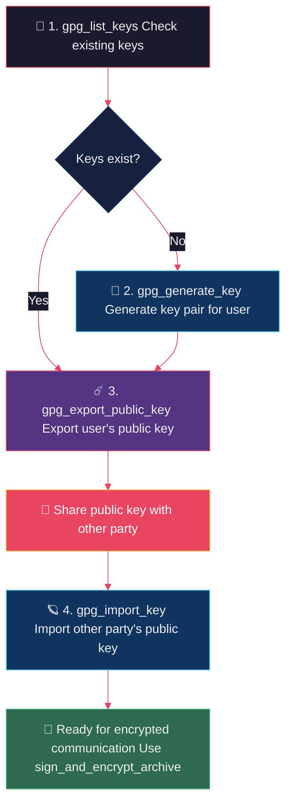
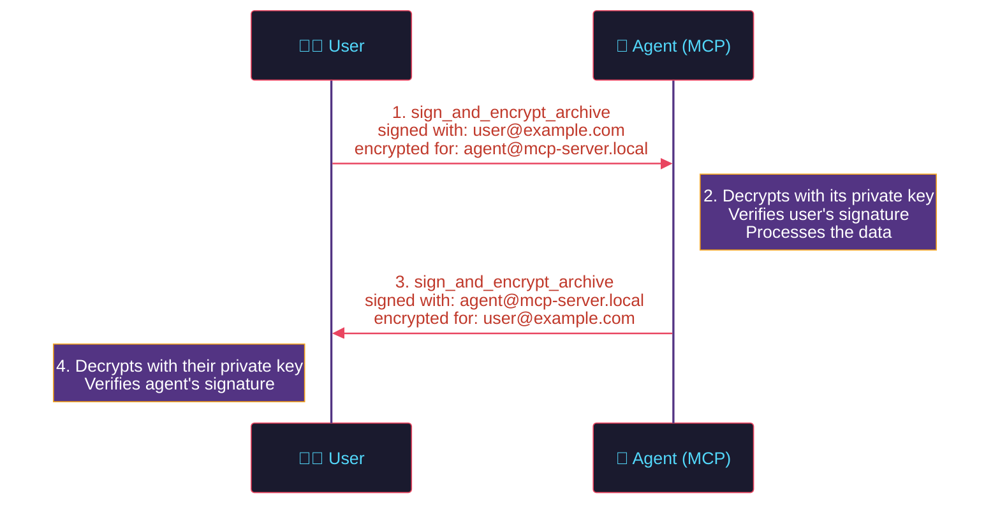
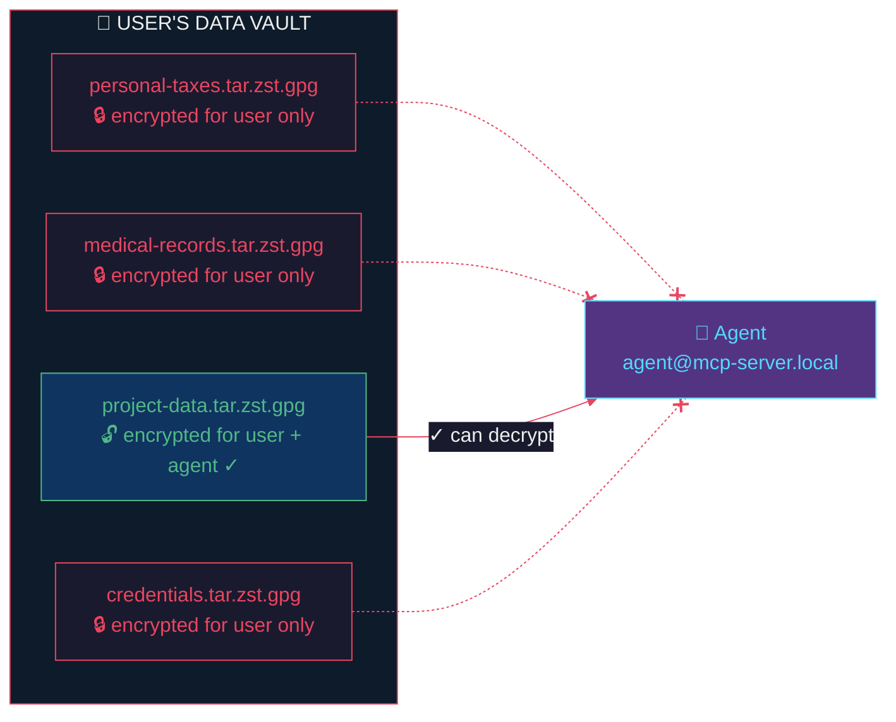
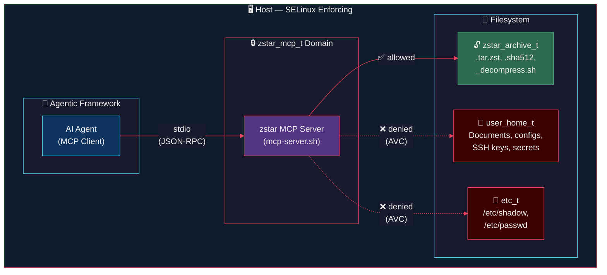
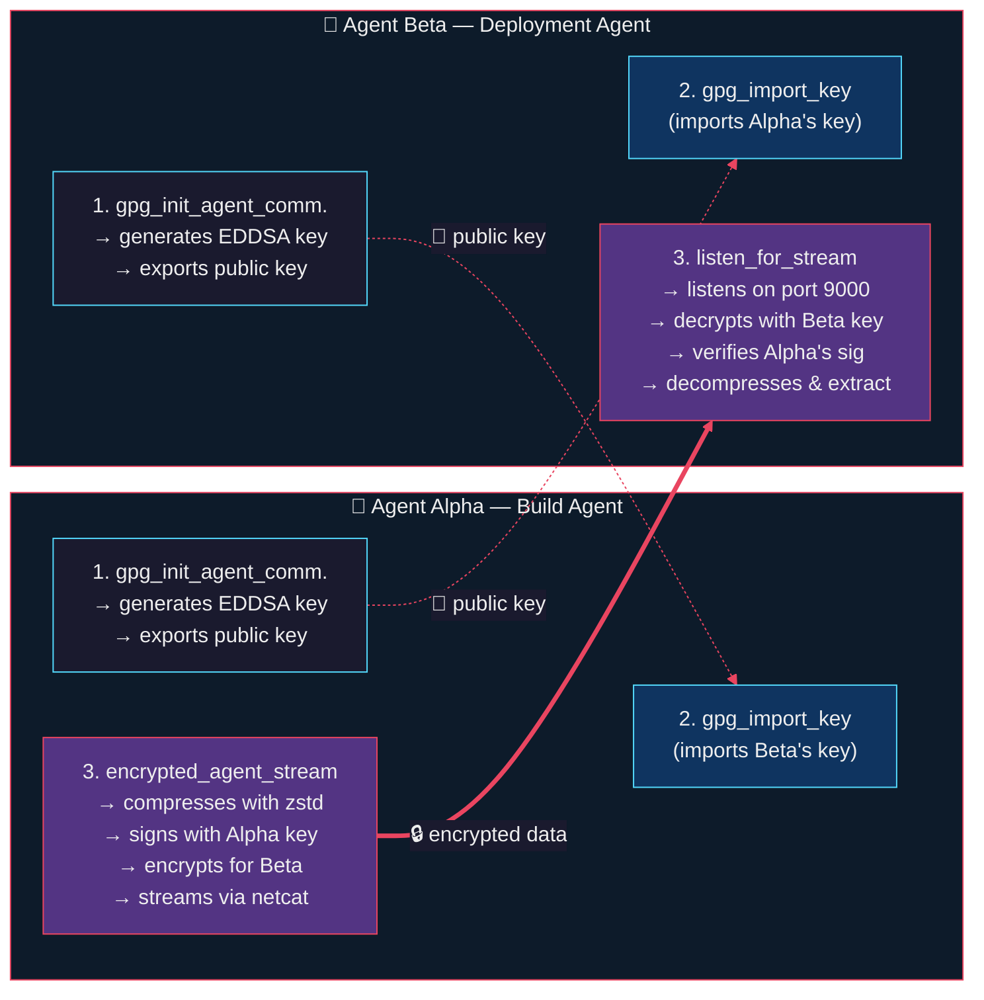
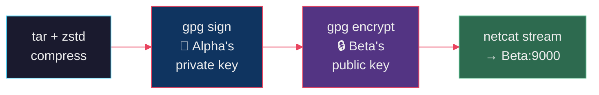
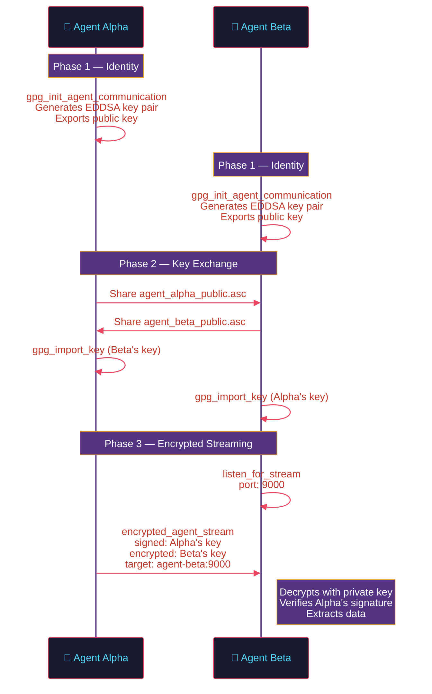
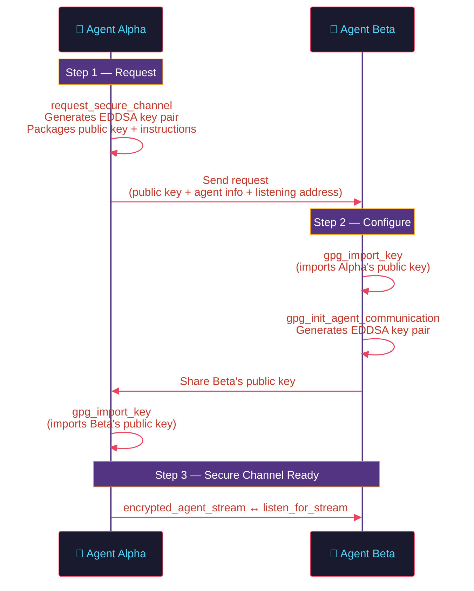

<div align="center">
  

  <h1>zstar-mcp-server</h1>

  <p>
    <strong>MCP server for the <a href="https://github.com/8r4n/zstar">zstar</a> archive utility</strong><br />
    <em>Make your private environment keys go supernova with the self-destructing encrypted archives</em>
  </p>

  <p>
    <a href="https://opensource.org/licenses/MIT"></a>
    <a href="https://nodejs.org/">= 18" /></a>
    <a href="https://ghcr.io/8r4n/zstar-mcp-server"></a>
    <a href="https://modelcontextprotocol.io/"></a>
    <a href="#openclaw-openclawjson"></a>
    <a href="https://github.com/8r4n/zstar"></a>
    <a href="https://github.com/sponsors/8r4n"></a>
  </p>
</div>

---

## Overview

An [MCP (Model Context Protocol)](https://modelcontextprotocol.io/) server that exposes all features of the [zstar](https://github.com/8r4n/zstar) archive utility. It allows AI assistants to create, extract, verify, encrypt, and sign compressed archives through a standardized tool interface.

The server uses **stdio transport**, compatible with [OpenClaw](https://github.com/openclaw), [Claude Desktop](https://claude.ai/download), and any other MCP client.

---

### 🛡️ Why zstar MCP Server?

> **Your data. Your keys. Your rules.** AI agents are powerful — but power without guardrails is a liability. The zstar MCP server gives you **cryptographic control** over every byte an agent touches.

**The problem:** AI agents need access to sensitive data — API keys, credentials, financial records, medical files — but handing over raw shell access is a security nightmare. Passphrases end up in shell history, files sit unencrypted on disk, and there's no audit trail for who accessed what.

**The solution:** zstar MCP server wraps battle-tested GPG encryption, zstd compression, and SHA-512 integrity verification into a **structured, auditable tool-call API**. The agent never touches raw `gpg` commands or filesystem internals — it calls typed, validated tools that enforce encryption-by-default.

| 🔑 Capability | What it means for you |
|---|---|
| **GPG public-key encryption** | Only *you* can decrypt your data — the agent can't read what you don't authorize |
| **Signed archives** | Every archive has a verifiable signature — you know exactly who created it |
| **Self-destructing archives** | Burn-after-reading mode shreds archives after extraction — no residue, no re-access |
| **SHA-512 integrity** | Automatic checksums on every archive — corruption and tampering are detected instantly |
| **Zero shell injection** | Structured API with parameter validation — no `; rm -rf /` surprises |
| **Agent-guided key setup** | GPG key generation, export, and import — all through tool calls, no manual commands |

**The bottom line:** Your private environment keys, credentials, and sensitive data stay encrypted at rest, signed for authenticity, and accessible only to parties you explicitly authorize. When you're done sharing, burn-after-reading ensures the data self-destructs. *That's* how you make your secrets go supernova. 💥

---

## Tools

The server provides **20 tools** covering every capability of the zstar utility — archive creation, network streaming, agent-to-agent encrypted communication, and GPG key management:

| Tool | Description |
|------|-------------|
| `create_archive` | Create a compressed `.tar.zst` archive with SHA-512 checksum and self-extracting script |
| `encrypt_archive` | Create a password-encrypted archive (AES-256 symmetric via GPG) |
| `sign_archive` | Create a GPG-signed archive for authenticity verification |
| `sign_and_encrypt_archive` | Create a signed and recipient-encrypted archive (public-key encryption) |
| `create_burn_after_reading_archive` | Create an archive that securely shreds itself after extraction |
| `extract_archive` | Extract an archive using the generated decompress script |
| `list_archive` | List archive contents without extracting |
| `verify_checksum` | Verify SHA-512 integrity checksum of an archive |
| `check_dependencies` | Check whether all required system dependencies are installed |
| `net_stream_archive` | Stream a compressed archive directly to a remote host via netcat (no disk I/O) |
| `net_stream_encrypted_archive` | Stream a password-encrypted archive directly to a remote host via netcat |
| `net_stream_signed_encrypted_archive` | Stream a GPG-signed and recipient-encrypted archive directly to a remote host via netcat |
| `listen_for_stream` | Listen for incoming streamed data using a decompress script's listen mode |
| `gpg_init_agent_communication` | Initialize GPG identity for encrypted agent-to-agent communication |
| `encrypted_agent_stream` | Stream GPG-signed and encrypted data directly from one agent to another over the network |
| `request_secure_channel` | Request a remote agent to configure itself for secure GPG-encrypted real-time communication |
| `gpg_list_keys` | List GPG keys in the keyring (public or secret) |
| `gpg_generate_key` | Generate a new GPG key pair for user or agent |
| `gpg_export_public_key` | Export a GPG public key in armored format for sharing |
| `gpg_import_key` | Import a GPG public key from a file into the keyring |

## Quick Start

### Docker (recommended)

Pull the pre-built image from GitHub Container Registry:

```bash
docker pull ghcr.io/8r4n/zstar-mcp-server:latest
```

Or build locally:

```bash
git clone --recurse-submodules https://github.com/8r4n/zstar-mcp-server.git
cd zstar-mcp-server
docker build -t zstar-mcp-server .
```

The Docker image is built on **Red Hat UBI 9 Minimal** — a hardened, SELinux-native base image with a minimal attack surface. All dependencies (`bash`, `tar`, `zstd`, `gpg`, `pv`, `ncat`, `jq`) and `tarzst.sh` are bundled — no additional setup required.

### npm

```bash
npm install zstar-mcp-server
```

Or clone and build from source:

```bash
git clone --recurse-submodules https://github.com/8r4n/zstar-mcp-server.git
cd zstar-mcp-server
npm install
npm run build
```

### Configuration

The server locates the `tarzst.sh` script in the following order:

1. **`ZSTAR_PATH` environment variable** — set to the absolute path of `tarzst.sh`
2. **System PATH** — looks for `tarzst` or `tarzst.sh` on your `PATH`

```bash
export ZSTAR_PATH=/usr/local/bin/tarzst.sh
```

> **Note:** The Docker image sets `ZSTAR_PATH` automatically — no configuration needed.

## Client Configuration

The server communicates over **stdio**, the standard transport supported by OpenClaw, Claude Desktop, and any other MCP client.

### Docker

#### OpenClaw (`openclaw.json`)

```json
{
  "mcpServers": {
    "zstar": {
      "command": "docker",
      "args": ["run", "--rm", "-i", "ghcr.io/8r4n/zstar-mcp-server:latest"]
    }
  }
}
```

#### Claude Desktop (`claude_desktop_config.json`)

```json
{
  "mcpServers": {
    "zstar": {
      "command": "docker",
      "args": ["run", "--rm", "-i", "ghcr.io/8r4n/zstar-mcp-server:latest"]
    }
  }
}
```

To mount a local directory for archive operations, add a volume mount:

```json
{
  "mcpServers": {
    "zstar": {
      "command": "docker",
      "args": ["run", "--rm", "-i", "-v", "/path/to/data:/data", "ghcr.io/8r4n/zstar-mcp-server:latest"]
    }
  }
}
```

### npm

#### OpenClaw (`openclaw.json`)

```json
{
  "mcpServers": {
    "zstar": {
      "command": "npx",
      "args": ["-y", "zstar-mcp-server"],
      "env": {
        "ZSTAR_PATH": "/path/to/tarzst.sh"
      }
    }
  }
}
```

Or if installed from source:

```json
{
  "mcpServers": {
    "zstar": {
      "command": "node",
      "args": ["/path/to/zstar-mcp-server/dist/index.js"],
      "env": {
        "ZSTAR_PATH": "/path/to/tarzst.sh"
      }
    }
  }
}
```

#### Claude Desktop (`claude_desktop_config.json`)

```json
{
  "mcpServers": {
    "zstar": {
      "command": "npx",
      "args": ["-y", "zstar-mcp-server"],
      "env": {
        "ZSTAR_PATH": "/path/to/tarzst.sh"
      }
    }
  }
}
```

## Usage

### Docker

```bash
docker run --rm -i ghcr.io/8r4n/zstar-mcp-server:latest
```

### Node.js

```bash
node dist/index.js
```

## Tool Reference

#### `create_archive`

Create a compressed tar.zst archive from files or directories.

**Parameters:**
| Name | Type | Required | Description |
|------|------|----------|-------------|
| `inputPaths` | `string[]` | Yes | Files or directories to archive |
| `compressionLevel` | `number` | No | zstd compression level (1-19). Default: 3 |
| `outputName` | `string` | No | Custom base name for output files |
| `excludePatterns` | `string[]` | No | File exclusion patterns for tar |
| `cwd` | `string` | No | Working directory |

**Output files:** `<name>.tar.zst`, `<name>.tar.zst.sha512`, `<name>_decompress.sh`

---

#### `encrypt_archive`

Create a password-encrypted archive using AES-256 symmetric encryption.

**Parameters:**
| Name | Type | Required | Description |
|------|------|----------|-------------|
| `inputPaths` | `string[]` | Yes | Files or directories to archive |
| `password` | `string` | Yes | Symmetric encryption password |
| `compressionLevel` | `number` | No | zstd compression level (1-19) |
| `outputName` | `string` | No | Custom base name |
| `excludePatterns` | `string[]` | No | Exclusion patterns |
| `cwd` | `string` | No | Working directory |

---

#### `sign_archive`

Create a GPG-signed archive for authenticity verification.

**Parameters:**
| Name | Type | Required | Description |
|------|------|----------|-------------|
| `inputPaths` | `string[]` | Yes | Files or directories to archive |
| `signingKeyId` | `string` | Yes | GPG key ID (e.g., email or fingerprint) |
| `passphrase` | `string` | Yes | Passphrase for the signing key |
| `compressionLevel` | `number` | No | zstd compression level (1-19) |
| `outputName` | `string` | No | Custom base name |
| `excludePatterns` | `string[]` | No | Exclusion patterns |
| `cwd` | `string` | No | Working directory |

---

#### `sign_and_encrypt_archive`

Create a signed and recipient-encrypted archive using GPG public-key encryption.

**Parameters:**
| Name | Type | Required | Description |
|------|------|----------|-------------|
| `inputPaths` | `string[]` | Yes | Files or directories to archive |
| `signingKeyId` | `string` | Yes | GPG key ID for signing |
| `passphrase` | `string` | Yes | Passphrase for the signing key |
| `recipientKeyId` | `string` | Yes | GPG key ID of the recipient |
| `compressionLevel` | `number` | No | zstd compression level (1-19) |
| `outputName` | `string` | No | Custom base name |
| `excludePatterns` | `string[]` | No | Exclusion patterns |
| `cwd` | `string` | No | Working directory |

---

#### `create_burn_after_reading_archive`

Create an archive with a self-erase routine. After extraction, the archive files are securely shredded.

**Parameters:**
| Name | Type | Required | Description |
|------|------|----------|-------------|
| `inputPaths` | `string[]` | Yes | Files or directories to archive |
| `compressionLevel` | `number` | No | zstd compression level (1-19) |
| `outputName` | `string` | No | Custom base name |
| `excludePatterns` | `string[]` | No | Exclusion patterns |
| `cwd` | `string` | No | Working directory |

---

#### `extract_archive`

Extract a zstar archive using the generated self-extracting decompress script.

**Parameters:**
| Name | Type | Required | Description |
|------|------|----------|-------------|
| `scriptPath` | `string` | Yes | Path to the `*_decompress.sh` script |
| `cwd` | `string` | No | Working directory |

---

#### `list_archive`

List the contents of a zstar archive without extracting.

**Parameters:**
| Name | Type | Required | Description |
|------|------|----------|-------------|
| `scriptPath` | `string` | Yes | Path to the `*_decompress.sh` script |
| `cwd` | `string` | No | Working directory |

---

#### `verify_checksum`

Verify the SHA-512 checksum of a zstar archive.

**Parameters:**
| Name | Type | Required | Description |
|------|------|----------|-------------|
| `checksumFile` | `string` | Yes | Path to the `.sha512` checksum file |
| `cwd` | `string` | No | Working directory |

---

#### `check_dependencies`

Check whether all required system dependencies are installed.

**Parameters:** None

**Returns:** Status of each dependency (bash, tar, zstd, sha512sum, numfmt, gpg, pv, nc).

---

#### `net_stream_archive`

Stream a compressed archive directly to a remote host via netcat, bypassing all disk I/O. No archive file, checksum, or decompress script is written to disk. Requires `nc` (netcat) on both sender and receiver.

**Parameters:**
| Name | Type | Required | Description |
|------|------|----------|-------------|
| `inputPaths` | `string[]` | Yes | Files or directories to archive and stream |
| `target` | `string` | Yes | Network destination in `host:port` format (e.g., `remote_host:9000`) |
| `compressionLevel` | `number` | No | zstd compression level (1-19). Default: 3 |
| `outputName` | `string` | No | Custom base name (used for stream identification) |
| `excludePatterns` | `string[]` | No | File exclusion patterns for tar |
| `cwd` | `string` | No | Working directory |

---

#### `net_stream_encrypted_archive`

Stream a password-encrypted (AES-256 symmetric) compressed archive directly to a remote host via netcat. No files are written to disk. The receiver needs the same password to decrypt.

**Parameters:**
| Name | Type | Required | Description |
|------|------|----------|-------------|
| `inputPaths` | `string[]` | Yes | Files or directories to archive and stream |
| `target` | `string` | Yes | Network destination in `host:port` format |
| `password` | `string` | Yes | Symmetric encryption password |
| `compressionLevel` | `number` | No | zstd compression level (1-19). Default: 3 |
| `outputName` | `string` | No | Custom base name (used for stream identification) |
| `excludePatterns` | `string[]` | No | File exclusion patterns for tar |
| `cwd` | `string` | No | Working directory |

---

#### `net_stream_signed_encrypted_archive`

Stream a GPG-signed and recipient-encrypted compressed archive directly to a remote host via netcat. Uses asymmetric encryption — the sender signs with their private key and encrypts for the recipient's public key. No files are written to disk.

**Parameters:**
| Name | Type | Required | Description |
|------|------|----------|-------------|
| `inputPaths` | `string[]` | Yes | Files or directories to archive and stream |
| `target` | `string` | Yes | Network destination in `host:port` format |
| `signingKeyId` | `string` | Yes | GPG key ID for signing (e.g., email or fingerprint) |
| `passphrase` | `string` | Yes | Passphrase for the signing key |
| `recipientKeyId` | `string` | Yes | GPG key ID of the recipient for encryption |
| `compressionLevel` | `number` | No | zstd compression level (1-19). Default: 3 |
| `outputName` | `string` | No | Custom base name (used for stream identification) |
| `excludePatterns` | `string[]` | No | File exclusion patterns for tar |
| `cwd` | `string` | No | Working directory |

---

#### `listen_for_stream`

Listen for incoming streamed data using a decompress script's listen mode. The decompress script receives, decrypts (if applicable), decompresses, and extracts streamed data in real-time. Requires `nc` (netcat). Start this **before** the sender streams data.

**Parameters:**
| Name | Type | Required | Description |
|------|------|----------|-------------|
| `scriptPath` | `string` | Yes | Path to the generated `*_decompress.sh` script |
| `port` | `number` | Yes | Port number to listen on (1-65535) |
| `cwd` | `string` | No | Working directory |

---

#### `gpg_init_agent_communication`

Initialize GPG identity for encrypted agent-to-agent communication. Generates a GPG key pair for the local agent (if not already present) and exports the public key. This is the first step in establishing a secure channel between two agents. See the [Agent-to-Agent Encrypted Streaming](#agent-to-agent-encrypted-streaming) section for the complete workflow.

**Parameters:**
| Name | Type | Required | Description |
|------|------|----------|-------------|
| `agentName` | `string` | Yes | Display name for the agent (e.g., `"Agent Alpha"` or `"Build Server"`) |
| `agentEmail` | `string` | Yes | Email identifier for the agent (e.g., `"agent-alpha@mcp-server.local"`) |
| `passphrase` | `string` | Yes | Passphrase to protect the agent's private key |
| `keyType` | `string` | No | Key type: `"RSA"`, `"DSA"`, or `"EDDSA"`. Default: `"EDDSA"` |
| `keyLength` | `number` | No | Key length in bits (1024-4096, for RSA/DSA). Default: 4096 |
| `expireDate` | `string` | No | Key expiry (e.g., `"1y"`, `"0"` for no expiry). Default: `"0"` |
| `outputFile` | `string` | No | File path to save the exported public key. If omitted, the armored key is returned directly |

**Returns:** Success status, armored public key, GPG fingerprint, and setup instructions for completing the key exchange.

---

#### `encrypted_agent_stream`

Stream GPG-signed and encrypted data directly from one agent to another over the network. Validates that both agents have each other's keys, then streams a signed and recipient-encrypted compressed archive via netcat. Requires prior key exchange via `gpg_init_agent_communication`. See the [Agent-to-Agent Encrypted Streaming](#agent-to-agent-encrypted-streaming) section for the complete workflow.

**Parameters:**
| Name | Type | Required | Description |
|------|------|----------|-------------|
| `inputPaths` | `string[]` | Yes | Files or directories to archive and stream to the remote agent |
| `target` | `string` | Yes | Remote agent's network address in `host:port` format (e.g., `agent-b-host:9000`) |
| `signingKeyId` | `string` | Yes | Local agent's GPG key ID for signing (e.g., `"agent-alpha@mcp-server.local"`) |
| `passphrase` | `string` | Yes | Passphrase for the local agent's signing key |
| `recipientKeyId` | `string` | Yes | Remote agent's GPG key ID for encryption (e.g., `"agent-beta@mcp-server.local"`) |
| `compressionLevel` | `number` | No | zstd compression level (1-19). Default: 3 |
| `outputName` | `string` | No | Custom base name for stream identification |
| `excludePatterns` | `string[]` | No | File exclusion patterns for tar |
| `cwd` | `string` | No | Working directory |

---

#### `request_secure_channel`

Request a remote agent to configure itself for secure real-time GPG-encrypted communication. Initializes the local agent's GPG identity and generates a structured request containing the public key and setup instructions. The remote agent uses this request to complete the channel setup. See the [Agent-to-Agent Encrypted Streaming](#agent-to-agent-encrypted-streaming) section for the complete workflow.

**Parameters:**
| Name | Type | Required | Description |
|------|------|----------|-------------|
| `agentName` | `string` | Yes | Display name for the requesting agent (e.g., `"Build Agent"`) |
| `agentEmail` | `string` | Yes | Email identifier for the requesting agent (e.g., `"agent-alpha@mcp-server.local"`) |
| `passphrase` | `string` | Yes | Passphrase to protect the requesting agent's private key |
| `keyType` | `string` | No | Key type: `"RSA"`, `"DSA"`, or `"EDDSA"`. Default: `"EDDSA"` |
| `keyLength` | `number` | No | Key length in bits (1024-4096, for RSA/DSA). Default: 4096 |
| `expireDate` | `string` | No | Key expiry (e.g., `"1y"`, `"0"` for no expiry). Default: `"0"` |
| `listeningAddress` | `string` | No | Network `host:port` where this agent will listen (e.g., `"agent-alpha-host:9000"`) |

---

#### `gpg_list_keys`

List GPG keys in the keyring. First step in the GPG setup walkthrough — check which keys are already available.

**Parameters:**
| Name | Type | Required | Description |
|------|------|----------|-------------|
| `secretOnly` | `boolean` | No | If true, list only secret (private) keys. Default: false |

---

#### `gpg_generate_key`

Generate a new GPG key pair. Creates both a public key (for others to encrypt data for you) and a private key (for decryption and signing).

**Parameters:**
| Name | Type | Required | Description |
|------|------|----------|-------------|
| `name` | `string` | Yes | Real name for the key (e.g., "Alice Smith" or "MCP Agent") |
| `email` | `string` | Yes | Email address for the key (e.g., "user@example.com") |
| `passphrase` | `string` | Yes | Passphrase to protect the private key |
| `keyType` | `string` | No | Key type: "RSA", "DSA", or "EDDSA". Default: "RSA" |
| `keyLength` | `number` | No | Key length in bits (1024-4096, for RSA/DSA). Default: 4096 |
| `expireDate` | `string` | No | Key expiry (e.g., "1y", "0" for no expiry). Default: "0" |

---

#### `gpg_export_public_key`

Export a GPG public key in armored (ASCII) format for sharing with the other party.

**Parameters:**
| Name | Type | Required | Description |
|------|------|----------|-------------|
| `keyId` | `string` | Yes | Key ID, email, or fingerprint to export |
| `outputFile` | `string` | No | File path to save the key. If omitted, returns the key directly |

---

#### `gpg_import_key`

Import a GPG public key from a file into the keyring. Use this to import the other party's public key.

**Parameters:**
| Name | Type | Required | Description |
|------|------|----------|-------------|
| `keyFile` | `string` | Yes | Path to the armored key file to import |

## GPG Key Setup Walkthrough

The MCP server includes 4 GPG key management tools that enable an agent to walk users through the complete GPG key setup process — no manual `gpg` commands needed.



### Step 1 — Check existing keys

```
gpg_list_keys({})
gpg_list_keys({ secretOnly: true })
```

The agent checks which keys are already in the keyring. If the user or agent already has a key pair, this step confirms it.

### Step 2 — Generate keys (if needed)

```
gpg_generate_key({
  name:       "Alice Smith",
  email:      "user@example.com",
  passphrase: "secure-passphrase",
  keyType:    "RSA",
  keyLength:  4096
})
```

For the agent's environment:

```
gpg_generate_key({
  name:       "MCP Agent",
  email:      "agent@mcp-server.local",
  passphrase: "agent-passphrase"
})
```

### Step 3 — Export public keys for sharing

```
gpg_export_public_key({
  keyId:      "user@example.com",
  outputFile: "./user_public.asc"
})

gpg_export_public_key({
  keyId:      "agent@mcp-server.local",
  outputFile: "./agent_public.asc"
})
```

### Step 4 — Import the other party's public key

```
gpg_import_key({ keyFile: "./agent_public.asc" })
gpg_import_key({ keyFile: "./user_public.asc" })
```

After this walkthrough, both parties can use `sign_and_encrypt_archive` for secure, bidirectional encrypted communication.

---

## GPG Encryption Scenarios

The following scenarios demonstrate how the zstar MCP server enables secure, encrypted communication between an AI agent and a user. These workflows show the real-world utility of the server: **the agent never handles plaintext secrets**, and the user retains full control over who can access their data.

### Prerequisites for GPG Scenarios

Both the user and the agent environment need GPG keys. Use the [GPG Key Setup Walkthrough](#gpg-key-setup-walkthrough) tools to set up keys interactively through the MCP server, or run the manual commands below:

```bash
# User generates their key pair (if they don't already have one)
gpg --full-generate-key          # follow prompts; e.g., user@example.com

# Agent environment generates its own key pair
gpg --full-generate-key          # e.g., agent@mcp-server.local

# Exchange public keys so each side can encrypt for the other
gpg --export --armor user@example.com      > user_public.asc
gpg --export --armor agent@mcp-server.local > agent_public.asc

# Import the other party's public key
gpg --import agent_public.asc    # user imports agent's public key
gpg --import user_public.asc     # agent imports user's public key
```

After this one-time setup both sides can encrypt data that **only the intended recipient can decrypt**.

---

### Scenario 1 — Bidirectional Encrypted Data Exchange

This scenario demonstrates a full round-trip: the user sends encrypted data to the agent, the agent processes it and returns encrypted results — all without plaintext ever being exposed on disk in an unprotected form.

#### How it works



#### Step 1 — User sends encrypted data to the agent

The user creates an archive signed with their key and encrypted for the agent:

```
User → Agent (via MCP tool call):

sign_and_encrypt_archive({
  inputPaths:    ["./financial-report.csv", "./projections/"],
  signingKeyId:  "user@example.com",
  passphrase:    "users-gpg-passphrase",
  recipientKeyId: "agent@mcp-server.local",
  outputName:    "data-for-agent"
})
```

**Output files:**
- `data-for-agent.tar.zst.gpg` — encrypted; only the agent's private key can decrypt
- `data-for-agent.tar.zst.sha512` — integrity checksum
- `data-for-agent_decompress.sh` — self-extracting script (handles decryption + verification)

#### Step 2 — Agent decrypts and processes

The agent extracts the archive using its own GPG private key. The decompress script automatically verifies the user's signature:

```
Agent (MCP tool call):

extract_archive({
  scriptPath: "./data-for-agent_decompress.sh"
})
```

The agent now has the plaintext files and can process them (analyze data, generate reports, etc.).

#### Step 3 — Agent returns encrypted results to the user

The agent packages its results and encrypts them for the user:

```
Agent → User (via MCP tool call):

sign_and_encrypt_archive({
  inputPaths:    ["./analysis-results/"],
  signingKeyId:  "agent@mcp-server.local",
  passphrase:    "agents-gpg-passphrase",
  recipientKeyId: "user@example.com",
  outputName:    "results-for-user"
})
```

#### Step 4 — User decrypts the results

The user runs the decompress script, which decrypts with their private key and verifies the agent's signature:

```bash
bash results-for-user_decompress.sh
# → Decrypts, verifies agent signature, extracts analysis-results/
```

#### Why this matters

| Property | Guarantee |
|----------|-----------|
| **Confidentiality** | Data is encrypted at rest — only the intended recipient's private key can decrypt |
| **Authenticity** | GPG signatures prove the sender's identity; tampering is detected |
| **Integrity** | SHA-512 checksums catch any corruption in transit or on disk |
| **Non-repudiation** | The sender cannot deny having created the archive (signature is tied to their key) |

---

### Scenario 2 — User-Controlled Private Data with Authorized Access

This scenario demonstrates how a user can encrypt sensitive data and selectively authorize the agent to access it using GPG public-key encryption. The user retains full control: **only archives explicitly encrypted for the agent's public key are accessible**.

#### The principle



#### Step 1 — User encrypts private data (agent has NO access)

The user creates encrypted archives for their own use. These are encrypted with the user's own key — the agent **cannot** decrypt them:

```
encrypt_archive({
  inputPaths: ["./tax-returns/"],
  password:   "users-secret-password",
  outputName: "personal-taxes"
})
```

Or using GPG public-key encryption for the user only:

```
sign_and_encrypt_archive({
  inputPaths:    ["./medical-records/"],
  signingKeyId:  "user@example.com",
  passphrase:    "users-gpg-passphrase",
  recipientKeyId: "user@example.com",   ← encrypted for self
  outputName:    "medical-records"
})
```

The agent has no way to decrypt either of these archives. The private keys belong solely to the user.

#### Step 2 — User grants the agent access to specific data

When the user decides to share specific data with the agent, they encrypt it for the agent's public key:

```
sign_and_encrypt_archive({
  inputPaths:    ["./project-data/"],
  signingKeyId:  "user@example.com",
  passphrase:    "users-gpg-passphrase",
  recipientKeyId: "agent@mcp-server.local",   ← authorized for agent
  outputName:    "project-data"
})
```

This is the explicit authorization step. The user is making a conscious decision: *"I want the agent to be able to read this specific data."*

#### Step 3 — Agent accesses only the authorized data

```
# ✓ This succeeds — the agent's private key can decrypt it
extract_archive({ scriptPath: "./project-data_decompress.sh" })

# ✗ This fails — the agent does not have the decryption key
extract_archive({ scriptPath: "./personal-taxes_decompress.sh" })
#   → GPG error: no secret key available for decryption
```

#### Step 4 — User revokes access

Access revocation is straightforward: the user simply stops encrypting new data for the agent's key. Previously shared archives remain encrypted — but no new data flows to the agent. For stronger revocation, the user can rotate their own keys.

#### The burn-after-reading option

For maximum security, use `create_burn_after_reading_archive` for one-time data sharing. After the agent extracts the data, the archive self-shreds:

```
create_burn_after_reading_archive({
  inputPaths: ["./one-time-credentials/"],
  outputName: "temp-access"
})
```

After extraction, the `.tar.zst`, `.sha512`, and `_decompress.sh` files are securely overwritten and deleted. The data exists only in the extracted form — there is no archive to re-extract or forward.

---

### Why the MCP Server Matters for Data Protection

The zstar MCP server bridges the gap between **powerful encryption tools** and **AI agent workflows**. Without it, an agent would need raw shell access, credential handling, and deep knowledge of GPG and tar commands. The MCP server provides:

| Capability | Without MCP Server | With zstar MCP Server |
|-----------|-------------------|----------------------|
| **Encryption** | Agent runs raw `gpg` commands, handles passphrases in shell history | Structured API with parameter validation; no shell injection risk |
| **Key management** | Agent must know GPG internals | Agent calls `sign_and_encrypt_archive` with key IDs |
| **Integrity** | Agent must manually run `sha512sum` | Automatic SHA-512 checksums on every archive |
| **Access control** | No boundary between "agent data" and "user data" | GPG public-key encryption enforces cryptographic access boundaries |
| **Audit trail** | None | Each archive is signed — provenance is verifiable |
| **Secure disposal** | Agent must know `shred` semantics | `create_burn_after_reading_archive` handles secure deletion |
| **Error handling** | Raw shell errors | Structured success/failure responses with exit codes |

The server turns GPG-based encryption from a manual, error-prone process into a **safe, auditable, tool-call API** that AI agents can use without ever needing direct access to private keys, shell commands, or filesystem internals.

---

### SELinux Mandatory Access Control for Agent Confinement

When the agentic framework is deployed on a host with **SELinux** enabled and configured so that all file access is routed through the MCP server, the kernel-enforced mandatory access control (MAC) provides an additional security boundary that restricts **what data the agent can read on the host** — regardless of what the agent's application-level code attempts.

#### How it works

The zstar project includes a ready-to-use SELinux policy module ([`zstar/selinux/`](zstar/selinux/)) that defines three security types:

| SELinux Type | Purpose |
|-------------|---------|
| `zstar_mcp_t` | **Process domain** — the security context the MCP server runs under |
| `zstar_archive_t` | **File type** — the label applied to archives, checksums, decompress scripts, and split parts |
| `zstar_exec_t` | **Entrypoint type** — the label on the MCP server executable, triggering automatic domain transition into `zstar_mcp_t` |

When the MCP server is launched, SELinux transitions it into the `zstar_mcp_t` domain. The policy then **explicitly allows** only the operations the server needs and **denies everything else by default**:

```
# The MCP server (zstar_mcp_t) can ONLY access files labeled zstar_archive_t
allow zstar_mcp_t zstar_archive_t:file { create read write open ... };
allow zstar_mcp_t zstar_archive_t:dir  { search read write ... };

# System utilities required by tarzst.sh (tar, zstd, gpg, etc.)
corecmd_exec_bin(zstar_mcp_t)
corecmd_exec_shell(zstar_mcp_t)

# GPG keyring access
gpg_entry_type(zstar_mcp_t)

# Stdio transport (inherited file descriptors from the MCP client)
allow zstar_mcp_t self:fifo_file { read write getattr };

# Everything else → DENIED (implicit SELinux default)
```

#### What the agent cannot do

Because SELinux policy is enforced **in the kernel**, even if the agent compromises or manipulates the MCP server process, it **cannot**:

| Blocked Action | Why |
|---------------|-----|
| Read `/etc/shadow`, SSH keys, or any user file not labeled `zstar_archive_t` | No `allow` rule for `zstar_mcp_t` to access `user_home_t`, `etc_t`, `ssh_home_t`, etc. |
| Write to arbitrary directories | Only `zstar_archive_t`-labeled directories are writable |
| Execute arbitrary binaries | Only `corecmd_exec_bin` (system `/usr/bin`) is allowed — not user scripts |
| Access other processes' memory or files | No `allow` rule for `zstar_mcp_t` to `ptrace` or read other domains |
| Escalate privileges | No `allow` rule for role or domain transitions beyond the defined policy |
| Disable or modify the SELinux policy | Policy management requires `semanage`/`setsebool` in the `unconfined_t` domain |

#### File context labeling

The file contexts configuration (`zstar.fc`) automatically labels zstar output artifacts with `zstar_archive_t`:

```
/home/[^/]+/.*\.tar\.zst              → zstar_archive_t
/home/[^/]+/.*\.tar\.zst\.gpg         → zstar_archive_t
/home/[^/]+/.*\.tar\.zst\.sha512      → zstar_archive_t
/home/[^/]+/.*_decompress\.sh         → zstar_archive_t
/home/[^/]+/.*\.tar\.zst\.[0-9]+\.part → zstar_archive_t
```

This means that when a user creates an archive, the resulting files are automatically labeled for MCP server access. All other files on the host — documents, credentials, configuration files, SSH keys — remain in their default SELinux contexts and are **invisible to the MCP server process**.

#### Deployment architecture



#### Policy interfaces for integration

The `zstar.if` interface file provides reusable policy macros for integrating with other SELinux-confined applications:

| Interface | Description |
|-----------|-------------|
| `zstar_read_archive` | Grant a domain **read-only** access to `zstar_archive_t` files |
| `zstar_manage_archive` | Grant a domain **full** (create/read/write/delete) access to `zstar_archive_t` files |

For example, if a separate deployment agent needs to read archives produced by the MCP server but should not create new ones:

```
# In the deployment agent's .te policy:
zstar_read_archive(deploy_agent_t)
```

#### Installing the SELinux policy

```bash
# Build and install the policy module
cd zstar/selinux
make -f /usr/share/selinux/devel/Makefile zstar.pp
sudo semodule -i zstar.pp

# Apply file contexts to existing files
sudo restorecon -Rv /home/*/
```

> **Note:** The SELinux policy works with both the Docker-based bash server and the Node.js/npm server. The Docker image is built on Red Hat UBI 9 Minimal — a hardened, SELinux-native base image. For Docker deployments, the container process inherits the host's SELinux enforcement when the Docker daemon is configured with `--selinux-enabled`.

---

### Quickstart: OpenClaw with Docker-Only Host Access Restriction

This guide configures OpenClaw to use the Docker-based zstar MCP server as the **sole file access mechanism**, preventing the agent from reading or writing arbitrary files on the host.

#### 1. Pull the hardened image

```bash
docker pull ghcr.io/8r4n/zstar-mcp-server:latest
```

#### 2. Create a dedicated data directory

Create a single directory that the agent is allowed to access. No other host path will be mounted:

```bash
mkdir -p ~/zstar-data
```

On SELinux-enabled hosts, label it so the confined MCP server process can access it:

```bash
sudo semanage fcontext -a -t zstar_archive_t "$HOME/zstar-data(/.*)?"
sudo restorecon -Rv ~/zstar-data
```

#### 3. Configure OpenClaw

Create or edit `openclaw.json` with the zstar server as the **only** MCP server — no filesystem, shell, or other tools:

```json
{
  "mcpServers": {
    "zstar": {
      "command": "docker",
      "args": [
        "run", "--rm", "-i",
        "--read-only",
        "--tmpfs", "/tmp",
        "--cap-drop=ALL",
        "--security-opt=no-new-privileges",
        "-v", "/home/you/zstar-data:/data",
        "ghcr.io/8r4n/zstar-mcp-server:latest"
      ]
    }
  }
}
```

Replace `/home/you/zstar-data` with the absolute path to your data directory.

> **Key flags:**
> - `--read-only` — container filesystem is immutable (prevents tampering with server binaries)
> - `--tmpfs /tmp` — writable scratch space for GPG operations and temp files (ephemeral, never touches the host)
> - `--cap-drop=ALL` — drops all Linux capabilities (no privilege escalation)
> - `--security-opt=no-new-privileges` — prevents `setuid`/`setgid` escalation inside the container
> - Only `/data` is mounted — the agent cannot access any other host path

#### 4. What the agent can and cannot do

| Action | Allowed | Why |
|--------|---------|-----|
| Create archives in `/data` | ✅ | Mounted volume |
| Extract archives in `/data` | ✅ | Mounted volume |
| Verify checksums in `/data` | ✅ | Mounted volume |
| Encrypt/sign archives in `/data` | ✅ | Mounted volume |
| Stream archives over the network | ✅ | Network streaming tools |
| Read `/etc/shadow`, SSH keys, user files | ❌ | Not mounted into container |
| Write outside `/data` | ❌ | Read-only filesystem + no other mounts |
| Execute host binaries | ❌ | Container isolation |
| Escalate privileges | ❌ | `--cap-drop=ALL` + `no-new-privileges` |

#### 5. Verify isolation

Start OpenClaw and ask the agent to create an archive:

```
Create a zstar archive of /data/myfiles
```

Then verify the agent **cannot** access anything outside `/data`:

```
List files in /etc
```

The agent will fail — it has no tool to list files, and the MCP server has no access to `/etc`.

#### 6. Add SELinux enforcement (RHEL/Fedora)

On SELinux-enforcing hosts, add `--security-opt label=type:zstar_mcp_t` to the Docker args for kernel-level MAC enforcement:

```json
{
  "mcpServers": {
    "zstar": {
      "command": "docker",
      "args": [
        "run", "--rm", "-i",
        "--read-only",
        "--tmpfs", "/tmp",
        "--cap-drop=ALL",
        "--security-opt=no-new-privileges",
        "--security-opt", "label=type:zstar_mcp_t",
        "-v", "/home/you/zstar-data:/data:Z",
        "ghcr.io/8r4n/zstar-mcp-server:latest"
      ]
    }
  }
}
```

The `:Z` volume suffix tells Docker to relabel the mount with the correct SELinux context. Combined with the `zstar_mcp_t` process domain, the kernel enforces that even if the container is compromised, only `zstar_archive_t`-labeled files are accessible.

---

## Use Case: Two AI Agents Streaming Compressed, GPG-Encrypted Data in Real Time

A common deployment pattern involves two AI agents — each running their own MCP client — that need to exchange data securely over a network in real time. For example:

- **Agent Alpha** (a build agent) produces build artifacts, logs, or model weights that must be delivered to **Agent Beta** (a deployment agent) on a remote host.
- Neither agent should write sensitive data to disk as unencrypted intermediate files.
- Both agents must be able to verify the identity of the other (authenticity) and ensure data hasn't been tampered with (integrity).
- The data should be compressed for efficient transfer over the wire.

The zstar MCP server solves this by combining **zstd compression**, **GPG public-key encryption**, **GPG signing**, and **netcat streaming** into a single tool-call pipeline. The entire flow — compress → sign → encrypt → stream — happens in memory with zero disk I/O on the sender side.



**What happens under the hood** (single pipeline, no temp files):



On the receiving end, Agent Beta's listener reverses the pipeline: **netcat receive → gpg decrypt (Beta's private key) → gpg verify (Alpha's public key) → zstd decompress → tar extract**.

The channel is bidirectional — Agent Beta can stream results back to Agent Alpha by reversing the roles. See the [Agent-to-Agent Encrypted Streaming](#agent-to-agent-encrypted-streaming) section below for the full three-phase workflow, tool call examples, and security properties.

---

## Agent-to-Agent Encrypted Streaming

The agent-to-agent encrypted streaming feature enables two MCP agents to establish a secure, authenticated communication channel and stream GPG-signed, encrypted data directly over the network — with **zero disk I/O** on the sender side. This goes beyond the file-based GPG scenarios above: data flows in real-time from one agent to another without ever being written to an intermediate file.

### How it works

The workflow has three phases: **identity initialization**, **key exchange**, and **encrypted streaming**.



### Phase 1 — Initialize agent identities

Each agent creates its own GPG identity using `gpg_init_agent_communication`. This generates an EDDSA key pair (by default) and exports the public key. If a key already exists for the given email, it is reused.

**Agent Alpha:**

```
gpg_init_agent_communication({
  agentName:  "Agent Alpha",
  agentEmail: "agent-alpha@mcp-server.local",
  passphrase: "alpha-secure-passphrase",
  outputFile: "./agent_alpha_public.asc"
})
```

**Returns:** Success status, armored public key, GPG fingerprint, and next-step instructions.

**Agent Beta:**

```
gpg_init_agent_communication({
  agentName:  "Agent Beta",
  agentEmail: "agent-beta@mcp-server.local",
  passphrase: "beta-secure-passphrase",
  outputFile: "./agent_beta_public.asc"
})
```

### Phase 2 — Exchange public keys

Each agent imports the other agent's public key into its keyring. The public key files can be shared through any secure channel (filesystem, MCP tool call, out-of-band transfer).

**Agent Alpha imports Beta's key:**

```
gpg_import_key({ keyFile: "./agent_beta_public.asc" })
```

**Agent Beta imports Alpha's key:**

```
gpg_import_key({ keyFile: "./agent_alpha_public.asc" })
```

After this step, both agents have each other's public keys and can encrypt data for the other party.

### Phase 3 — Stream encrypted data

The receiving agent starts listening on a port first, then the sending agent streams signed and encrypted data directly to that port.

**Step 1 — Agent Beta starts listening:**

```
listen_for_stream({
  scriptPath: "./data_decompress.sh",
  port:       9000
})
```

**Step 2 — Agent Alpha streams encrypted data:**

```
encrypted_agent_stream({
  inputPaths:    ["./data-for-beta/", "./config.json"],
  target:        "agent-beta-host:9000",
  signingKeyId:  "agent-alpha@mcp-server.local",
  passphrase:    "alpha-secure-passphrase",
  recipientKeyId: "agent-beta@mcp-server.local"
})
```

The `encrypted_agent_stream` tool:
1. **Validates the target** — checks `host:port` format (hostname: alphanumeric, dots, underscores, hyphens; port: 1-65535)
2. **Verifies the signing key** — confirms Alpha's private key exists in the keyring (directs to `gpg_init_agent_communication` if missing)
3. **Verifies the recipient key** — confirms Beta's public key exists in the keyring (directs to `gpg_import_key` if missing)
4. **Streams the archive** — compresses with zstd, signs with Alpha's private key, encrypts for Beta's public key, and sends over netcat in a single pipeline

On the receiving end, Agent Beta's listener decrypts the stream with its private key, verifies Alpha's signature, and extracts the data — all in real-time.

### Bidirectional communication

The channel is bidirectional. Agent Beta can stream data back to Agent Alpha by reversing the roles:

```
# Agent Alpha listens
listen_for_stream({ scriptPath: "./results_decompress.sh", port: 9001 })

# Agent Beta streams back
encrypted_agent_stream({
  inputPaths:    ["./results/"],
  target:        "agent-alpha-host:9001",
  signingKeyId:  "agent-beta@mcp-server.local",
  passphrase:    "beta-secure-passphrase",
  recipientKeyId: "agent-alpha@mcp-server.local"
})
```

### Requesting a secure channel

The `request_secure_channel` tool streamlines the setup process by allowing one agent to programmatically ask another agent to configure itself for secure communication. Instead of manually coordinating key exchange, Agent Alpha generates a structured request that Agent Beta can act on directly.



**Agent Alpha requests a secure channel:**

```
request_secure_channel({
  agentName:        "Agent Alpha",
  agentEmail:       "agent-alpha@mcp-server.local",
  passphrase:       "alpha-secure-passphrase",
  listeningAddress: "agent-alpha-host:9001"
})
```

**Returns:** A structured request containing Alpha's public key, fingerprint, listening address, and step-by-step instructions for Agent Beta to complete the setup.

**Agent Beta processes the request:**

1. Imports Alpha's public key: `gpg_import_key({ keyFile: "./alpha_public.asc" })`
2. Initializes its own identity: `gpg_init_agent_communication({ agentName: "Agent Beta", ... })`
3. Shares its public key back to Alpha

After this exchange, both agents have each other's keys and can use `encrypted_agent_stream` for secure real-time communication.

### Security properties

| Property | How it's enforced |
|----------|-------------------|
| **Confidentiality** | Data is encrypted with the recipient's public key — only their private key can decrypt it |
| **Authenticity** | The archive is signed with the sender's private key — the receiver verifies the signature |
| **Integrity** | SHA-512 checksums detect any corruption or tampering in transit |
| **Non-repudiation** | The sender cannot deny creating the archive — the signature is tied to their GPG key |
| **Zero disk I/O (sender)** | The compressed, signed, and encrypted stream goes directly over the network — no intermediate files on the sender |
| **Key validation** | Both the signing key and recipient key are verified before streaming begins — clear error messages guide the user if keys are missing |

### When to use agent-to-agent streaming vs. file-based encryption

| Use case | Tool |
|----------|------|
| One agent requests another to set up a secure channel | `request_secure_channel` |
| Two agents need to exchange data in real-time over the network | `gpg_init_agent_communication` + `encrypted_agent_stream` |
| User sends encrypted data to an agent (or vice versa) via shared filesystem | `sign_and_encrypt_archive` |
| One-time data transfer with no residue | `create_burn_after_reading_archive` |
| Streaming without encryption | `net_stream_archive` |
| Streaming with symmetric (password) encryption | `net_stream_encrypted_archive` |
| Streaming with asymmetric (GPG) encryption (manual key setup) | `net_stream_signed_encrypted_archive` |

## Development

### Node.js (TypeScript)

```bash
npm install       # Install dependencies
npm run build     # Build TypeScript
npm test          # Run all tests
npm run test:watch # Run tests in watch mode
```

### Docker

```bash
git clone --recurse-submodules https://github.com/8r4n/zstar-mcp-server.git
cd zstar-mcp-server
docker build -t zstar-mcp-server .
docker run --rm -i zstar-mcp-server
```

## Testing

The project includes **123 tests** using [Vitest](https://vitest.dev/):

| Suite | File | Tests | Description |
|-------|------|-------|-------------|
| Unit | `test/zstar.test.ts` | 44 | Tests the zstar wrapper module directly (including GPG key functions, agent communication, secure channel requests, network streaming validation, and end-to-end agent key exchange) |
| MCP Integration | `test/server.test.ts` | 38 | Tests the TypeScript server via `InMemoryTransport` (all 20 tools, schema validation, error handling, and end-to-end agent-to-agent key exchange workflow) |
| OpenClaw Integration | `test/openclaw.test.ts` | 14 | End-to-end tests over stdio via `StdioClientTransport` (TypeScript server) |
| Bash Server | `test/bash-server.test.ts` | 27 | End-to-end tests over stdio via `StdioClientTransport` (bash server — same implementation used in Docker) |

Tests cover tool registration, schema validation, dependency checking, checksum verification (valid and corrupted files), GPG key management, agent-to-agent communication initialization, secure channel requests, encrypted streaming validation, network streaming target validation, end-to-end agent key exchange with bidirectional communication, error handling, and the full MCP protocol handshake over stdio — the same way OpenClaw launches servers.

## Prerequisites

### System Dependencies

The [zstar](https://github.com/8r4n/zstar) utility (`tarzst.sh`) must be installed. The following system tools are required:

| Dependency | Required | Linux (RHEL/Fedora) | macOS (via Homebrew) |
|-----------|----------|-------|------|
| `bash` | ✅ | Version ≥ 4.0 | `brew install bash` (macOS ships v3) |
| `tar` | ✅ | Pre-installed | Pre-installed |
| `zstd` | ✅ | `dnf install zstd` | `brew install zstd` |
| `sha512sum` | ✅ | Part of coreutils | `shasum -a 512` (pre-installed); or `brew install coreutils` |
| `numfmt` | ✅ | Part of coreutils | `brew install coreutils` (provides `gnumfmt`) |
| `gpg` | ✅ | `dnf install gnupg2` | `brew install gnupg` |
| `pv` | ✅ | `dnf install pv` | `brew install pv` |
| `nc` | ⬡ Optional | `dnf install nmap-ncat` | Pre-installed |

> **Note:** `nc` (netcat) is only required for network streaming tools (`net_stream_archive`, `net_stream_encrypted_archive`, `net_stream_signed_encrypted_archive`, `listen_for_stream`) and agent-to-agent encrypted streaming (`encrypted_agent_stream`). All other tools work without it.

#### Quick install

**Linux (RHEL/Fedora/CentOS):**
```bash
sudo dnf install bash tar zstd coreutils gnupg2 pv
```

**macOS (Homebrew):**
```bash
brew install bash zstd coreutils gnupg pv
```

> **Note:** The MCP server automatically detects macOS and uses platform-appropriate commands (`shasum -a 512` instead of `sha512sum`, `gnumfmt` instead of `numfmt`). No manual aliasing is needed.
>
> **Docker users:** All dependencies are pre-installed in the hardened Red Hat UBI 9 Docker image — no manual setup required.

### Runtime

- **Docker** (recommended) — hardened Red Hat UBI 9 image with all dependencies bundled
- **Node.js** ≥ 18 (for npm-based installation)

## 💖 Sponsorship

zstar MCP Server is a free, open-source project maintained in spare time. Sponsorship helps keep it actively developed — new features, faster bug fixes, better documentation, and broader platform support.

### Why sponsor?

- **Sustain active maintenance** — dependency updates, security patches, and compatibility fixes on a regular cadence
- **Accelerate new features** — GPG agent integration, streaming extraction progress, and more tools on the roadmap
- **Keep it free and open** — sponsorship means the project stays MIT-licensed and open to everyone

### How funds are used

| Category | Purpose |
|---|---|
| 🔬 **Development time** | Core feature work, refactoring, and performance improvements |
| 🧪 **Testing infrastructure** | CI runners, test environments across Linux and macOS |
| 📖 **Documentation** | Guides, examples, and tutorials for new integrations |
| 🛡️ **Security audits** | Occasional third-party review of cryptographic code paths |

### Sponsorship tiers

| Tier | Monthly | Benefits |
|---|---|---|
| 🌟 **Stardust Supporter** | $5 | Your name in the README sponsors list · GitHub Sponsor badge on your profile |
| 🌌 **Nebula Backer** | $10 | Everything above · Early access to pre-release features and changelogs · Priority issue labeling |
| 💥 **Supernova Patron** | $50 | Everything above · Direct support via a dedicated discussion thread · Input on roadmap priorities · Logo in README (companies welcome) |

Sponsor via **[GitHub Sponsors](https://github.com/sponsors/8r4n)** or **[Ko-fi](https://ko-fi.com/8r4n)**. Even a one-time coffee keeps the project caffeinated ☕.

### Crypto donations

USDC accepted on the **Ethereum** network:

```
0xa1a808Bf8999a054839167d6C7E7cf689798E8B4
```

> ⚠️ **Ethereum network only.** Do not send USDC over any other network to this address or your funds may be lost.

---

## 🌟 Sponsors

*Your name here — [become a Stardust Supporter](https://github.com/sponsors/8r4n) ($5/mo or more)*

<!-- sponsors -->
<!-- sponsors -->

---

## 💥 Sponsor Logos

*Your logo here — [become a Supernova Patron](https://github.com/sponsors/8r4n) ($50/mo)*

<!-- sponsor-logos -->
<!-- sponsor-logos -->

---

## Contributing

Contributions are welcome! See [CONTRIBUTING.md](CONTRIBUTING.md) for guidelines on:

- 🐛 [Reporting bugs](https://github.com/8r4n/zstar-mcp-server/issues/new?labels=bug&template=bug_report.md)
- 💡 [Requesting features](https://github.com/8r4n/zstar-mcp-server/issues/new?labels=enhancement&template=feature_request.md)
- 🔧 Submitting pull requests
- 🏗️ Development setup and project structure

## License

MIT

---

<div align="center">
  <sub>Built on the <a href="https://modelcontextprotocol.io/">Model Context Protocol</a> · Powered by <a href="https://github.com/8r4n/zstar">zstar</a></sub>
</div>
