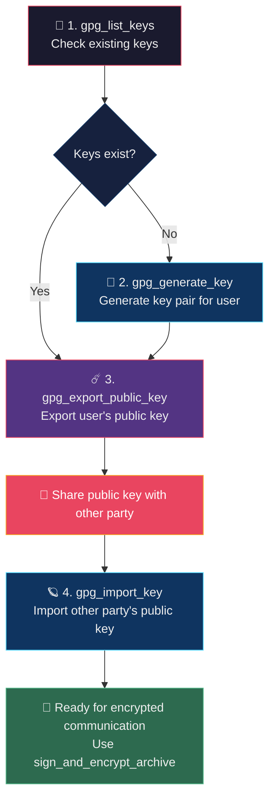
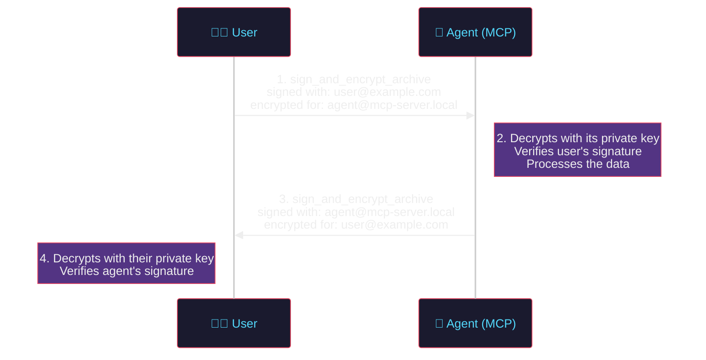
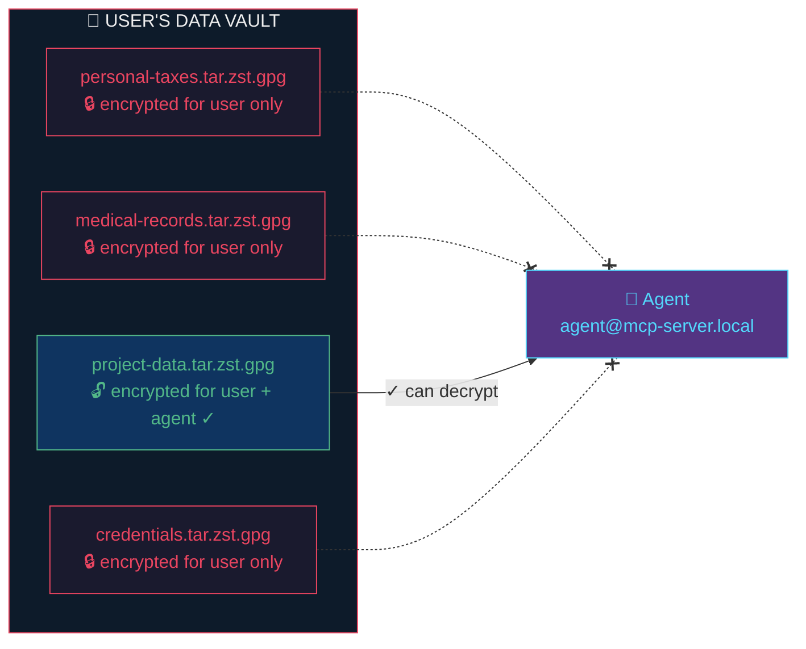

<div align="center">
  

  <h1>zstar-mcp-server</h1>

  <p>
    <strong>MCP server for the <a href="https://github.com/8r4n/zstar">zstar</a> archive utility</strong><br />
    <em>Make your private environment keys go supernova with the self-destructing encrypted archives</em>
  </p>

  <p>
    <a href="https://opensource.org/licenses/MIT"></a>
    <a href="https://nodejs.org/">= 18" /></a>
    <a href="https://modelcontextprotocol.io/"></a>
    <a href="#openclaw-openclawjson"></a>
    <a href="https://github.com/8r4n/zstar"></a>
  </p>
</div>

---

## Overview

An [MCP (Model Context Protocol)](https://modelcontextprotocol.io/) server that exposes all features of the [zstar](https://github.com/8r4n/zstar) archive utility. It allows AI assistants to create, extract, verify, encrypt, and sign compressed archives through a standardized tool interface.

The server uses **stdio transport**, compatible with [OpenClaw](https://github.com/openclaw), [Claude Desktop](https://claude.ai/download), and any other MCP client.

---

### 🛡️ Why zstar MCP Server?

> **Your data. Your keys. Your rules.** AI agents are powerful — but power without guardrails is a liability. The zstar MCP server gives you **cryptographic control** over every byte an agent touches.

**The problem:** AI agents need access to sensitive data — API keys, credentials, financial records, medical files — but handing over raw shell access is a security nightmare. Passphrases end up in shell history, files sit unencrypted on disk, and there's no audit trail for who accessed what.

**The solution:** zstar MCP server wraps battle-tested GPG encryption, zstd compression, and SHA-512 integrity verification into a **structured, auditable tool-call API**. The agent never touches raw `gpg` commands or filesystem internals — it calls typed, validated tools that enforce encryption-by-default.

| 🔑 Capability | What it means for you |
|---|---|
| **GPG public-key encryption** | Only *you* can decrypt your data — the agent can't read what you don't authorize |
| **Signed archives** | Every archive has a verifiable signature — you know exactly who created it |
| **Self-destructing archives** | Burn-after-reading mode shreds archives after extraction — no residue, no re-access |
| **SHA-512 integrity** | Automatic checksums on every archive — corruption and tampering are detected instantly |
| **Zero shell injection** | Structured API with parameter validation — no `; rm -rf /` surprises |
| **Agent-guided key setup** | GPG key generation, export, and import — all through tool calls, no manual commands |

**The bottom line:** Your private environment keys, credentials, and sensitive data stay encrypted at rest, signed for authenticity, and accessible only to parties you explicitly authorize. When you're done sharing, burn-after-reading ensures the data self-destructs. *That's* how you make your secrets go supernova. 💥

---

## Tools

The server provides **13 tools** covering every capability of the zstar utility plus GPG key management:

| Tool | Description |
|------|-------------|
| `create_archive` | Create a compressed `.tar.zst` archive with SHA-512 checksum and self-extracting script |
| `encrypt_archive` | Create a password-encrypted archive (AES-256 symmetric via GPG) |
| `sign_archive` | Create a GPG-signed archive for authenticity verification |
| `sign_and_encrypt_archive` | Create a signed and recipient-encrypted archive (public-key encryption) |
| `create_burn_after_reading_archive` | Create an archive that securely shreds itself after extraction |
| `extract_archive` | Extract an archive using the generated decompress script |
| `list_archive` | List archive contents without extracting |
| `verify_checksum` | Verify SHA-512 integrity checksum of an archive |
| `check_dependencies` | Check whether all required system dependencies are installed |
| `gpg_list_keys` | List GPG keys in the keyring (public or secret) |
| `gpg_generate_key` | Generate a new GPG key pair for user or agent |
| `gpg_export_public_key` | Export a GPG public key in armored format for sharing |
| `gpg_import_key` | Import a GPG public key from a file into the keyring |

## Quick Start

### Installation

```bash
npm install zstar-mcp-server
```

Or clone and build from source:

```bash
git clone https://github.com/8r4n/zstar-mcp-server.git
cd zstar-mcp-server
npm install
npm run build
```

### Configuration

The server locates the `tarzst.sh` script in the following order:

1. **`ZSTAR_PATH` environment variable** — set to the absolute path of `tarzst.sh`
2. **System PATH** — looks for `tarzst` or `tarzst.sh` on your `PATH`

```bash
export ZSTAR_PATH=/usr/local/bin/tarzst.sh
```

## Client Configuration

The server communicates over **stdio**, the standard transport supported by OpenClaw, Claude Desktop, and other MCP clients.

### OpenClaw (`openclaw.json`)

Add the server to the `mcpServers` section of your `openclaw.json` (typically at `~/.openclaw/openclaw.json`):

```json
{
  "mcpServers": {
    "zstar": {
      "command": "npx",
      "args": ["-y", "zstar-mcp-server"],
      "env": {
        "ZSTAR_PATH": "/path/to/tarzst.sh"
      }
    }
  }
}
```

Or if installed from source:

```json
{
  "mcpServers": {
    "zstar": {
      "command": "node",
      "args": ["/path/to/zstar-mcp-server/dist/index.js"],
      "env": {
        "ZSTAR_PATH": "/path/to/tarzst.sh"
      }
    }
  }
}
```

### Claude Desktop (`claude_desktop_config.json`)

```json
{
  "mcpServers": {
    "zstar": {
      "command": "npx",
      "args": ["-y", "zstar-mcp-server"],
      "env": {
        "ZSTAR_PATH": "/path/to/tarzst.sh"
      }
    }
  }
}
```

## Usage

Start the server directly (it communicates over stdio):

```bash
node dist/index.js
```

## Tool Reference

#### `create_archive`

Create a compressed tar.zst archive from files or directories.

**Parameters:**
| Name | Type | Required | Description |
|------|------|----------|-------------|
| `inputPaths` | `string[]` | Yes | Files or directories to archive |
| `compressionLevel` | `number` | No | zstd compression level (1-19). Default: 3 |
| `outputName` | `string` | No | Custom base name for output files |
| `excludePatterns` | `string[]` | No | File exclusion patterns for tar |
| `cwd` | `string` | No | Working directory |

**Output files:** `<name>.tar.zst`, `<name>.tar.zst.sha512`, `<name>_decompress.sh`

---

#### `encrypt_archive`

Create a password-encrypted archive using AES-256 symmetric encryption.

**Parameters:**
| Name | Type | Required | Description |
|------|------|----------|-------------|
| `inputPaths` | `string[]` | Yes | Files or directories to archive |
| `password` | `string` | Yes | Symmetric encryption password |
| `compressionLevel` | `number` | No | zstd compression level (1-19) |
| `outputName` | `string` | No | Custom base name |
| `excludePatterns` | `string[]` | No | Exclusion patterns |
| `cwd` | `string` | No | Working directory |

---

#### `sign_archive`

Create a GPG-signed archive for authenticity verification.

**Parameters:**
| Name | Type | Required | Description |
|------|------|----------|-------------|
| `inputPaths` | `string[]` | Yes | Files or directories to archive |
| `signingKeyId` | `string` | Yes | GPG key ID (e.g., email or fingerprint) |
| `passphrase` | `string` | Yes | Passphrase for the signing key |
| `compressionLevel` | `number` | No | zstd compression level (1-19) |
| `outputName` | `string` | No | Custom base name |
| `excludePatterns` | `string[]` | No | Exclusion patterns |
| `cwd` | `string` | No | Working directory |

---

#### `sign_and_encrypt_archive`

Create a signed and recipient-encrypted archive using GPG public-key encryption.

**Parameters:**
| Name | Type | Required | Description |
|------|------|----------|-------------|
| `inputPaths` | `string[]` | Yes | Files or directories to archive |
| `signingKeyId` | `string` | Yes | GPG key ID for signing |
| `passphrase` | `string` | Yes | Passphrase for the signing key |
| `recipientKeyId` | `string` | Yes | GPG key ID of the recipient |
| `compressionLevel` | `number` | No | zstd compression level (1-19) |
| `outputName` | `string` | No | Custom base name |
| `excludePatterns` | `string[]` | No | Exclusion patterns |
| `cwd` | `string` | No | Working directory |

---

#### `create_burn_after_reading_archive`

Create an archive with a self-erase routine. After extraction, the archive files are securely shredded.

**Parameters:**
| Name | Type | Required | Description |
|------|------|----------|-------------|
| `inputPaths` | `string[]` | Yes | Files or directories to archive |
| `compressionLevel` | `number` | No | zstd compression level (1-19) |
| `outputName` | `string` | No | Custom base name |
| `excludePatterns` | `string[]` | No | Exclusion patterns |
| `cwd` | `string` | No | Working directory |

---

#### `extract_archive`

Extract a zstar archive using the generated self-extracting decompress script.

**Parameters:**
| Name | Type | Required | Description |
|------|------|----------|-------------|
| `scriptPath` | `string` | Yes | Path to the `*_decompress.sh` script |
| `cwd` | `string` | No | Working directory |

---

#### `list_archive`

List the contents of a zstar archive without extracting.

**Parameters:**
| Name | Type | Required | Description |
|------|------|----------|-------------|
| `scriptPath` | `string` | Yes | Path to the `*_decompress.sh` script |
| `cwd` | `string` | No | Working directory |

---

#### `verify_checksum`

Verify the SHA-512 checksum of a zstar archive.

**Parameters:**
| Name | Type | Required | Description |
|------|------|----------|-------------|
| `checksumFile` | `string` | Yes | Path to the `.sha512` checksum file |
| `cwd` | `string` | No | Working directory |

---

#### `check_dependencies`

Check whether all required system dependencies are installed.

**Parameters:** None

**Returns:** Status of each dependency (bash, tar, zstd, sha512sum, numfmt, gpg, pv).

---

#### `gpg_list_keys`

List GPG keys in the keyring. First step in the GPG setup walkthrough — check which keys are already available.

**Parameters:**
| Name | Type | Required | Description |
|------|------|----------|-------------|
| `secretOnly` | `boolean` | No | If true, list only secret (private) keys. Default: false |

---

#### `gpg_generate_key`

Generate a new GPG key pair. Creates both a public key (for others to encrypt data for you) and a private key (for decryption and signing).

**Parameters:**
| Name | Type | Required | Description |
|------|------|----------|-------------|
| `name` | `string` | Yes | Real name for the key (e.g., "Alice Smith" or "MCP Agent") |
| `email` | `string` | Yes | Email address for the key (e.g., "user@example.com") |
| `passphrase` | `string` | Yes | Passphrase to protect the private key |
| `keyType` | `string` | No | Key type: "RSA", "DSA", or "EDDSA". Default: "RSA" |
| `keyLength` | `number` | No | Key length in bits (1024-4096, for RSA/DSA). Default: 4096 |
| `expireDate` | `string` | No | Key expiry (e.g., "1y", "0" for no expiry). Default: "0" |

---

#### `gpg_export_public_key`

Export a GPG public key in armored (ASCII) format for sharing with the other party.

**Parameters:**
| Name | Type | Required | Description |
|------|------|----------|-------------|
| `keyId` | `string` | Yes | Key ID, email, or fingerprint to export |
| `outputFile` | `string` | No | File path to save the key. If omitted, returns the key directly |

---

#### `gpg_import_key`

Import a GPG public key from a file into the keyring. Use this to import the other party's public key.

**Parameters:**
| Name | Type | Required | Description |
|------|------|----------|-------------|
| `keyFile` | `string` | Yes | Path to the armored key file to import |

## GPG Key Setup Walkthrough

The MCP server includes 4 GPG key management tools that enable an agent to walk users through the complete GPG key setup process — no manual `gpg` commands needed.



### Step 1 — Check existing keys

```
gpg_list_keys({})
gpg_list_keys({ secretOnly: true })
```

The agent checks which keys are already in the keyring. If the user or agent already has a key pair, this step confirms it.

### Step 2 — Generate keys (if needed)

```
gpg_generate_key({
  name:       "Alice Smith",
  email:      "user@example.com",
  passphrase: "secure-passphrase",
  keyType:    "RSA",
  keyLength:  4096
})
```

For the agent's environment:

```
gpg_generate_key({
  name:       "MCP Agent",
  email:      "agent@mcp-server.local",
  passphrase: "agent-passphrase"
})
```

### Step 3 — Export public keys for sharing

```
gpg_export_public_key({
  keyId:      "user@example.com",
  outputFile: "./user_public.asc"
})

gpg_export_public_key({
  keyId:      "agent@mcp-server.local",
  outputFile: "./agent_public.asc"
})
```

### Step 4 — Import the other party's public key

```
gpg_import_key({ keyFile: "./agent_public.asc" })
gpg_import_key({ keyFile: "./user_public.asc" })
```

After this walkthrough, both parties can use `sign_and_encrypt_archive` for secure, bidirectional encrypted communication.

---

## GPG Encryption Scenarios

The following scenarios demonstrate how the zstar MCP server enables secure, encrypted communication between an AI agent and a user. These workflows show the real-world utility of the server: **the agent never handles plaintext secrets**, and the user retains full control over who can access their data.

### Prerequisites for GPG Scenarios

Both the user and the agent environment need GPG keys. Use the [GPG Key Setup Walkthrough](#gpg-key-setup-walkthrough) tools to set up keys interactively through the MCP server, or run the manual commands below:

```bash
# User generates their key pair (if they don't already have one)
gpg --full-generate-key          # follow prompts; e.g., user@example.com

# Agent environment generates its own key pair
gpg --full-generate-key          # e.g., agent@mcp-server.local

# Exchange public keys so each side can encrypt for the other
gpg --export --armor user@example.com      > user_public.asc
gpg --export --armor agent@mcp-server.local > agent_public.asc

# Import the other party's public key
gpg --import agent_public.asc    # user imports agent's public key
gpg --import user_public.asc     # agent imports user's public key
```

After this one-time setup both sides can encrypt data that **only the intended recipient can decrypt**.

---

### Scenario 1 — Bidirectional Encrypted Data Exchange

This scenario demonstrates a full round-trip: the user sends encrypted data to the agent, the agent processes it and returns encrypted results — all without plaintext ever being exposed on disk in an unprotected form.

#### How it works



#### Step 1 — User sends encrypted data to the agent

The user creates an archive signed with their key and encrypted for the agent:

```
User → Agent (via MCP tool call):

sign_and_encrypt_archive({
  inputPaths:    ["./financial-report.csv", "./projections/"],
  signingKeyId:  "user@example.com",
  passphrase:    "users-gpg-passphrase",
  recipientKeyId: "agent@mcp-server.local",
  outputName:    "data-for-agent"
})
```

**Output files:**
- `data-for-agent.tar.zst.gpg` — encrypted; only the agent's private key can decrypt
- `data-for-agent.tar.zst.sha512` — integrity checksum
- `data-for-agent_decompress.sh` — self-extracting script (handles decryption + verification)

#### Step 2 — Agent decrypts and processes

The agent extracts the archive using its own GPG private key. The decompress script automatically verifies the user's signature:

```
Agent (MCP tool call):

extract_archive({
  scriptPath: "./data-for-agent_decompress.sh"
})
```

The agent now has the plaintext files and can process them (analyze data, generate reports, etc.).

#### Step 3 — Agent returns encrypted results to the user

The agent packages its results and encrypts them for the user:

```
Agent → User (via MCP tool call):

sign_and_encrypt_archive({
  inputPaths:    ["./analysis-results/"],
  signingKeyId:  "agent@mcp-server.local",
  passphrase:    "agents-gpg-passphrase",
  recipientKeyId: "user@example.com",
  outputName:    "results-for-user"
})
```

#### Step 4 — User decrypts the results

The user runs the decompress script, which decrypts with their private key and verifies the agent's signature:

```bash
bash results-for-user_decompress.sh
# → Decrypts, verifies agent signature, extracts analysis-results/
```

#### Why this matters

| Property | Guarantee |
|----------|-----------|
| **Confidentiality** | Data is encrypted at rest — only the intended recipient's private key can decrypt |
| **Authenticity** | GPG signatures prove the sender's identity; tampering is detected |
| **Integrity** | SHA-512 checksums catch any corruption in transit or on disk |
| **Non-repudiation** | The sender cannot deny having created the archive (signature is tied to their key) |

---

### Scenario 2 — User-Controlled Private Data with Authorized Access

This scenario demonstrates how a user can encrypt sensitive data and selectively authorize the agent to access it using GPG public-key encryption. The user retains full control: **only archives explicitly encrypted for the agent's public key are accessible**.

#### The principle



#### Step 1 — User encrypts private data (agent has NO access)

The user creates encrypted archives for their own use. These are encrypted with the user's own key — the agent **cannot** decrypt them:

```
encrypt_archive({
  inputPaths: ["./tax-returns/"],
  password:   "users-secret-password",
  outputName: "personal-taxes"
})
```

Or using GPG public-key encryption for the user only:

```
sign_and_encrypt_archive({
  inputPaths:    ["./medical-records/"],
  signingKeyId:  "user@example.com",
  passphrase:    "users-gpg-passphrase",
  recipientKeyId: "user@example.com",   ← encrypted for self
  outputName:    "medical-records"
})
```

The agent has no way to decrypt either of these archives. The private keys belong solely to the user.

#### Step 2 — User grants the agent access to specific data

When the user decides to share specific data with the agent, they encrypt it for the agent's public key:

```
sign_and_encrypt_archive({
  inputPaths:    ["./project-data/"],
  signingKeyId:  "user@example.com",
  passphrase:    "users-gpg-passphrase",
  recipientKeyId: "agent@mcp-server.local",   ← authorized for agent
  outputName:    "project-data"
})
```

This is the explicit authorization step. The user is making a conscious decision: *"I want the agent to be able to read this specific data."*

#### Step 3 — Agent accesses only the authorized data

```
# ✓ This succeeds — the agent's private key can decrypt it
extract_archive({ scriptPath: "./project-data_decompress.sh" })

# ✗ This fails — the agent does not have the decryption key
extract_archive({ scriptPath: "./personal-taxes_decompress.sh" })
#   → GPG error: no secret key available for decryption
```

#### Step 4 — User revokes access

Access revocation is straightforward: the user simply stops encrypting new data for the agent's key. Previously shared archives remain encrypted — but no new data flows to the agent. For stronger revocation, the user can rotate their own keys.

#### The burn-after-reading option

For maximum security, use `create_burn_after_reading_archive` for one-time data sharing. After the agent extracts the data, the archive self-shreds:

```
create_burn_after_reading_archive({
  inputPaths: ["./one-time-credentials/"],
  outputName: "temp-access"
})
```

After extraction, the `.tar.zst`, `.sha512`, and `_decompress.sh` files are securely overwritten and deleted. The data exists only in the extracted form — there is no archive to re-extract or forward.

---

### Why the MCP Server Matters for Data Protection

The zstar MCP server bridges the gap between **powerful encryption tools** and **AI agent workflows**. Without it, an agent would need raw shell access, credential handling, and deep knowledge of GPG and tar commands. The MCP server provides:

| Capability | Without MCP Server | With zstar MCP Server |
|-----------|-------------------|----------------------|
| **Encryption** | Agent runs raw `gpg` commands, handles passphrases in shell history | Structured API with parameter validation; no shell injection risk |
| **Key management** | Agent must know GPG internals | Agent calls `sign_and_encrypt_archive` with key IDs |
| **Integrity** | Agent must manually run `sha512sum` | Automatic SHA-512 checksums on every archive |
| **Access control** | No boundary between "agent data" and "user data" | GPG public-key encryption enforces cryptographic access boundaries |
| **Audit trail** | None | Each archive is signed — provenance is verifiable |
| **Secure disposal** | Agent must know `shred` semantics | `create_burn_after_reading_archive` handles secure deletion |
| **Error handling** | Raw shell errors | Structured success/failure responses with exit codes |

The server turns GPG-based encryption from a manual, error-prone process into a **safe, auditable, tool-call API** that AI agents can use without ever needing direct access to private keys, shell commands, or filesystem internals.

## Development

```bash
npm install       # Install dependencies
npm run build     # Build TypeScript
npm test          # Run all tests
npm run test:watch # Run tests in watch mode
```

## Testing

The project includes **45 tests** using [Vitest](https://vitest.dev/):

| Suite | File | Tests | Description |
|-------|------|-------|-------------|
| Unit | `test/zstar.test.ts` | 14 | Tests the zstar wrapper module directly (including GPG key functions) |
| MCP Integration | `test/server.test.ts` | 21 | Tests the server via `InMemoryTransport` |
| OpenClaw Integration | `test/openclaw.test.ts` | 10 | End-to-end tests over stdio via `StdioClientTransport` |

Tests cover tool registration, schema validation, dependency checking, checksum verification (valid and corrupted files), GPG key management, error handling, and the full MCP protocol handshake over stdio — the same way OpenClaw launches servers.

## Prerequisites

### System Dependencies

The [zstar](https://github.com/8r4n/zstar) utility (`tarzst.sh`) must be installed. The following system tools are required:

| Dependency | Required | Notes |
|-----------|----------|-------|
| `bash` | ✅ | Version ≥ 4.0 |
| `tar` | ✅ | |
| `zstd` | ✅ | |
| `sha512sum` | ✅ | Part of coreutils |
| `numfmt` | ✅ | Part of coreutils |
| `gpg` | ✅ | Required for encryption/signing |
| `pv` | ✅ | Required for progress bars during compression |

### Runtime

- **Node.js** ≥ 18

## License

MIT

---

<div align="center">
  <sub>Built on the <a href="https://modelcontextprotocol.io/">Model Context Protocol</a> · Powered by <a href="https://github.com/8r4n/zstar">zstar</a></sub>
</div>
